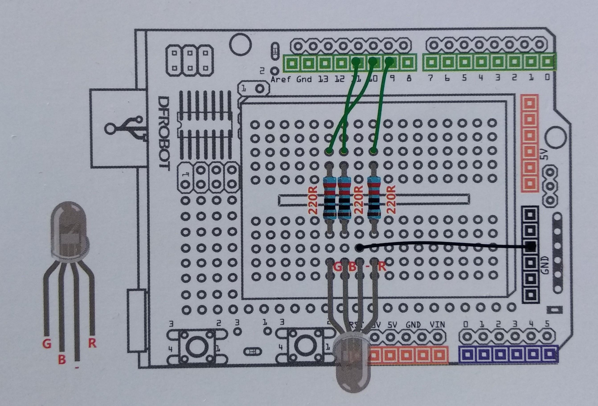

# ArduinoControlViaWebSpeech
Arduino RGB component control via Web Speech API and web sockets.

## Schematics

**Note**: The value of each is resistor is 220R.

## Installation
* At the root folder of the project run:
```npm install ```
* At the "client" folder run:
```bower install```
* Run the application (at the root folder) by typing:
```node app```

## Demo
Watch a demo here: https://www.dropbox.com/s/1xp1m8ixcbjavns/arduino_web_speech_2.mp4?dl=0
